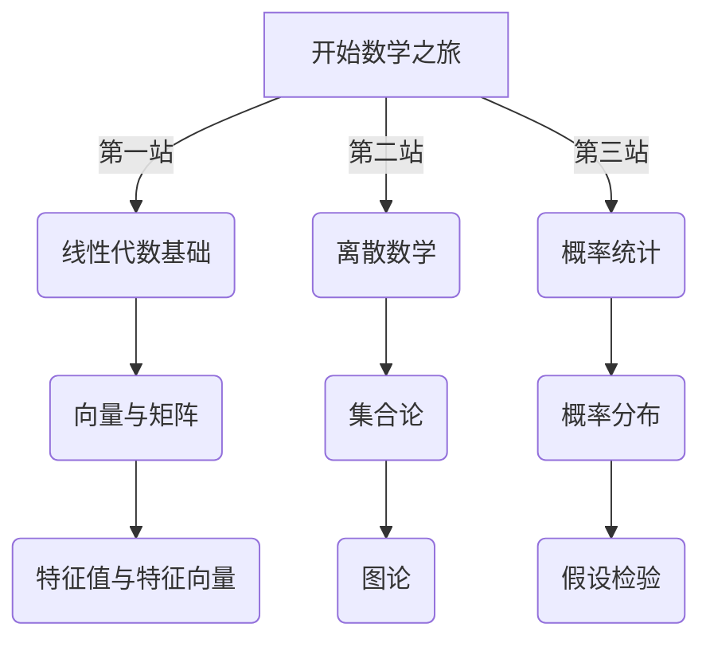

# 🔥 Math_notes 🧮
> *点燃你的数学激情，构建CS必备的数学思维！*

  

## 📚 简介

<table>
  <tr>
    </td>
    <td>
      
作为一名计算机专业的大一本科生，各种各样的数学知识学起来真的很难受，对吧？🤯

      
尤其是对我这种理解力不高的人，学线性代数，学离散数学真的让我头皮发麻... 😱

      
所以我创造了这个仓库，用来存放个人的CS数学笔记。里面不仅有最基本的知识点，还有例题，还有其他的一些乱七八糟的个人理解。

    </td>
  </tr>
</table>

##  🌟 内容亮点

- 🚀 **微积分** - 每一个工科学生必会的数学知识
- 💎 **线性代数** - 向量、矩阵、特征值和那些令人头疼的变换
- 🔮 **离散数学** - 集合论、图论、逻辑与证明方法
- 🧩 **概率论与数理统计** - 从基础概率到机器学习必备统计知识

## 💫 视觉化学习

  

## 🎯 学习路线图

## 🚀 **开始吧!**

  

> 💡 **学习窍门**: 每天坚持一点，比一次性学习大量内容效果更好！

## 🤝 贡献

若有错误，欢迎指正！让我们一起构建最好的CS数学笔记库！✨

  
  
<em>数学 + 计算机科学 = 🔥</em>

